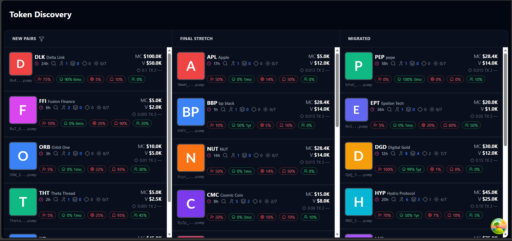
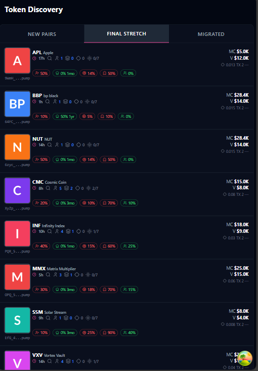
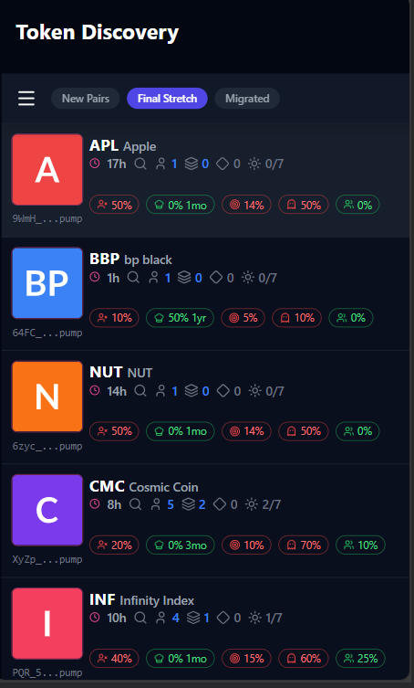

# 🪙 Axiom Trade Token Discovery Table (Frontend Clone)

**Live Demo:** [https://axiom-trade-clone.vercel.app](https://axiom-trade-clone.vercel.app)  
**Repository:** [https://github.com/sanjana-adepu/axiom-trade-clone](https://github.com/sanjana-adepu/axiom-trade-clone)

A pixel-perfect frontend clone of **Axiom Trade’s Token Discovery Table**, built with **Next.js 14**, **TypeScript**, **Tailwind CSS**, **Redux Toolkit**, and **React Query**.  
Implements real-time token updates, smooth transitions, responsive layout, and reusable atomic components.

---

## ✨ Features

- Pixel-perfect UI (≤ 2 px difference verified)  
- Fully responsive (320 px → 4K)  
- Real-time mock price updates (WebSocket simulation)  
- Smooth hover, click, tooltip, and modal interactions  
- Skeleton + shimmer loading states  
- Error boundaries and graceful fallbacks  
- Memoized, reusable components (Atomic Design)  
- High Lighthouse performance scores (≥ 90 desktop/mobile)  
- Redux Toolkit + React Query integration  
- Accessible UI components via shadcn/ui + Radix  

---

## 🧭 Tech Stack

- Next.js 14 (App Router)  
- TypeScript (strict mode)  
- Tailwind CSS  
- Redux Toolkit  
- React Query  
- shadcn/ui + Radix UI  
- Lucide Icons  
- ESLint + Prettier  

---

## 🧱 Folder Structure

```
src/
 ├─ app/
 │   ├─ layout.tsx
 │   └─ page.tsx
 │
 ├─ components/
 │   ├─ tokens/
 │   │   ├─ layouts/
 │   │   │   ├─ DesktopLayout.tsx
 │   │   │   ├─ MobileLayout.tsx
 │   │   │   └─ TableLayout.tsx
 │   │   │
 │   │   ├─ ui/
 │   │   │   ├─ DisplayCard.tsx
 │   │   │   ├─ ImageLogo.tsx
 │   │   │   ├─ SecurityBadges.tsx
 │   │   │   └─ Table.tsx
 │   │   │
 │   │   ├─ TokenTable.tsx
 │   │   └─ MainContent.tsx
 │   │
 │   └─ common/
 │       ├─ Tooltip.tsx
 │       ├─ Modal.tsx
 │       ├─ SkeletonLoader.tsx
 │       └─ ErrorBoundary.tsx
 │
 ├─ hooks/
 │   └─ useTokens.ts
 │
 ├─ store/
 │   ├─ tokenSlice.ts
 │   └─ store.ts
 │
 ├─ lib/
 │   └─ api.ts
 │
 ├─ styles/
 │   └─ globals.css
 │
 └─ public/
     └─ api/seed/tokens.json
```

---

## 🚀 Getting Started

```bash
# Clone the repository
git clone https://github.com/sanjana-adepu/axiom-trade-clone.git
cd axiom-trade-clone

# Install dependencies
pnpm install

# Start the development server
pnpm dev
```

Visit → [http://localhost:3000](http://localhost:3000)

---

## 🌐 Deployment

- Hosted on **Vercel**
- Automatic deployments from the `main` branch  
- Live URL: [https://axiom-trade-clone.vercel.app](https://axiom-trade-clone.vercel.app)

---


## 📸 Responsive Layout Snapshots

```md



```

---

## 🧠 Notes

- Architecture follows **Atomic Design principles**  
- Components are **highly reusable and performance-optimized**  
---

## 🧾 License

For educational and demonstration purposes only.  
All rights to the original **Axiom Trade** design belong to their respective owners.
